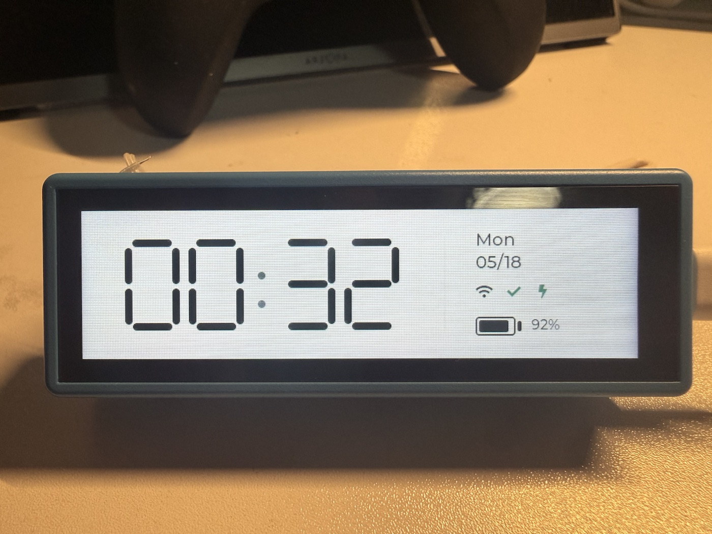

# ESP32 Landscape Desk Clock

A landscape LVGL application for the Waveshare ESP32-S3-Touch-LCD-3.49 board. The current UI is built on a unified MVP + EventBus architecture and includes a desk clock screen plus an MQTT-driven music player screen.



## Features

- Landscape 640 x 172 UI for the Waveshare 3.49-inch touch LCD.
- Clock screen with a large seven-segment HH:MM display and blinking seconds colon.
- Status area with weekday, date, WiFi, NTP sync, USB power, and battery state.
- Music player screen driven by Shairport Sync MQTT metadata.
- Album cover rendering with a dynamic blurred cover background.
- Gesture-based screen navigation between clock and music views.
- WiFi time synchronization with fallback NTP servers:
  - `ntp.ntsc.ac.cn`
  - `ntp.aliyun.com`
  - `ntp.tencent.com`
- RTC update after successful NTP synchronization.
- Battery percentage smoothing to reduce display jitter.
- Battery-friendly dimming after inactivity.
- Screen stays bright while connected to a USB host.

## UI Architecture

The app uses a strict MVP + EventBus flow:

```text
Hardware / MQTT / RTC / Power
        |
        v
Services hold snapshots and heavy buffers
        |
        v
EventBus publishes lightweight change notifications
        |
        v
Presenter drains events from Screen::onTick()
        |
        v
View mutates LVGL widgets on the UI thread
```

Key rules:

- `EventBus` only carries small, trivially-copyable notifications.
- Services own snapshots and heavy data such as decoded cover pixels.
- Presenters are the only UI layer objects that consume events.
- Views never subscribe to `EventBus`, call services, or own business state.
- `ScreenManager` owns screen lifecycle; each screen owns its Presenter and View.
- LVGL object updates happen from the UI tick path only.

## Hardware

- Waveshare ESP32-S3-Touch-LCD-3.49
- ESP32-S3 with PSRAM
- PCF85063 RTC
- Battery voltage ADC input
- USB Serial/JTAG connection for flashing and monitoring

Official board documentation: [Waveshare ESP32-S3-Touch-LCD-3.49](https://docs.waveshare.net/ESP32-S3-Touch-LCD-3.49/)

## Project Layout

- `main/main.cpp` — firmware bootstrap: initializes power, network, LVGL, services, and screen manager.
- `main/lvgl_port.cpp` — LCD/QSPI hardware, LVGL init, flush, tick timer, and render task.
- `main/touch_drv.cpp` — AXS15231B touch read and coordinate mapping.
- `main/clock_net.cpp` — WiFi connection and NTP synchronization.
- `main/music_mqtt.cpp` — Shairport Sync MQTT transport adapter.
- `main/app/core/event/` — `AppEvent`, `EventBus`, and the ring-buffer event queue.
- `main/app/features/clock/` — Clock MVP files: model, presenter, view, and seven-segment widget.
- `main/app/features/music/` — Music MVP files: state, model, presenter, view, cover/background widgets, and visualizer widget.
- `main/app/screens/` — `Screen`, `ScreenManager`, screen lifecycle owners, and gesture routing.
- `main/app/services/` — Snapshot-owning services for time, power, network, MQTT state, cover decoding, and Shairport parsing.
- `main/app/ui/` — UI assets such as fonts.
- `sim/` — SDL/LVGL music UI simulator for desktop screenshots and MQTT/offline smoke tests.
- `tests/` — Host-side regression tests for models, presenters, services, event queue, and UI helpers.
- `components/` — Board support code and sensor libraries.
- `docs/superpowers/` — architecture specs and implementation plans used during the migration.

## Local Configuration

WiFi and MQTT credentials are intentionally not committed to the repository.

Create a local secrets file before building:

```sh
cp main/clock_secrets_example.h main/clock_secrets.h
```

Then edit `main/clock_secrets.h`:

```cpp
constexpr const char *kWifiSsid = "YOUR_WIFI_SSID";
constexpr const char *kWifiPassword = "YOUR_WIFI_PASSWORD";
constexpr const char *kMqttHost = "192.168.31.100";
constexpr int kMqttPort = 1883;
constexpr const char *kMqttUsername = "mqtt";
constexpr const char *kMqttPassword = "YOUR_MQTT_PASSWORD";
```

`main/clock_secrets.h` is ignored by Git.

## Build

Activate ESP-IDF v6.0.1:

```sh
source ~/.espressif/tools/activate_idf_v6.0.1.sh
```

Build the firmware:

```sh
idf.py build
```

This branch was validated with ESP-IDF v6.0.1 and the ESP32-S3 toolchain.

## Flash

Connect the board over USB, then flash:

```sh
idf.py -p /dev/cu.usbmodem111401 flash
```

Use the correct serial port for your machine if it differs.

## Monitor

```sh
idf.py -p /dev/cu.usbmodem111401 monitor
```

The monitor log shows WiFi connection status, selected NTP server, synchronization result, and power-source detection.

## Simulator

Build the simulator:

```sh
cmake -S sim -B build-sim
cmake --build build-sim --target music_ui_sim
```

Offline metadata smoke test:

```sh
SDL_VIDEODRIVER=dummy SDL_RENDER_DRIVER=software \
  build-sim/music_ui_sim --offline --run-ms 1200 --screenshot /tmp/music-ui.bmp
```

MQTT cover/background smoke test:

```sh
build-sim/music_ui_sim \
  --mqtt-host 192.168.31.100 \
  --mqtt-user mqtt \
  --mqtt-pass YOUR_MQTT_PASSWORD \
  --run-ms 6500 \
  --screenshot /tmp/music-ui-bg.bmp
```

Use the headless SDL variables above when running from CI or a non-GUI shell.

## Verification

Useful host-side checks:

```sh
c++ -std=c++17 -DSIM_BUILD -Itests/stubs -Imain -I. \
  tests/test_music_background_image.cpp \
  main/app/features/music/widgets/background_image.cpp \
  main/music_background.cpp \
  -o /tmp/test_music_background_image && /tmp/test_music_background_image

c++ -std=c++17 -DSIM_BUILD -Itests/stubs -Imain -I. \
  tests/test_music_background.cpp \
  -o /tmp/test_music_background && /tmp/test_music_background
```

## Notes

- USB host detection uses ESP-IDF USB Serial/JTAG connection status. A simple USB charger or power bank may not be detectable as a USB host.
- The hardware charging status pin is not exposed to an ESP32 GPIO on this board, so the UI indicates USB host power rather than charger IC state.
- The current firmware image is close to the app partition limit because of embedded UI/font assets. Keep an eye on partition headroom when adding more resources.

## License

This project is released under the MIT License. See [LICENSE](LICENSE).
